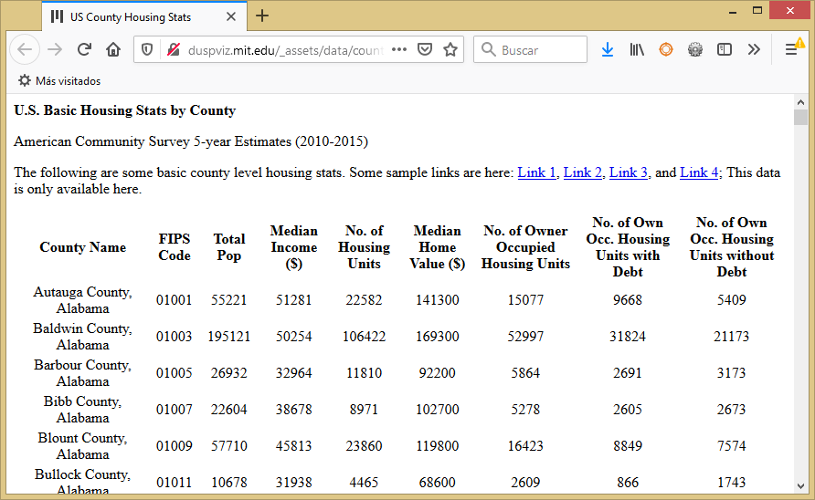
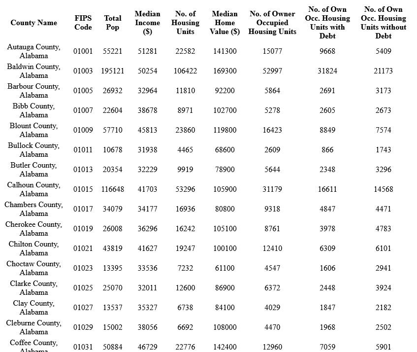
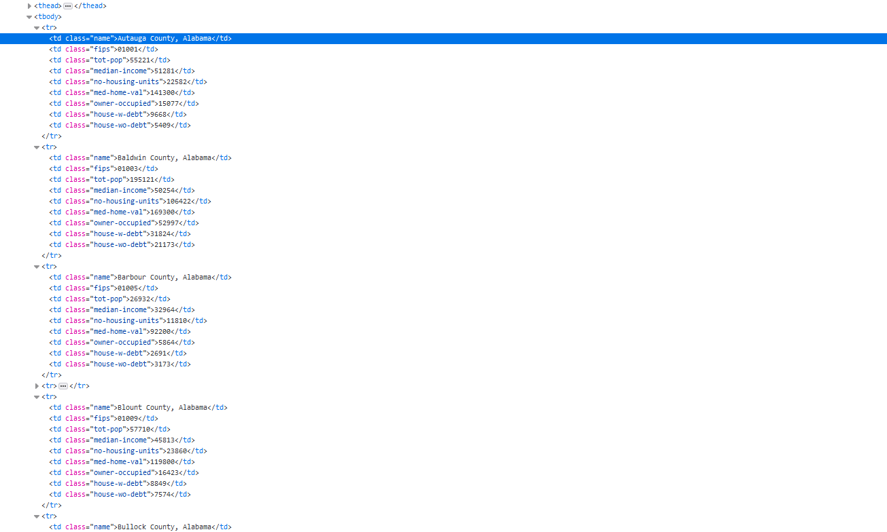
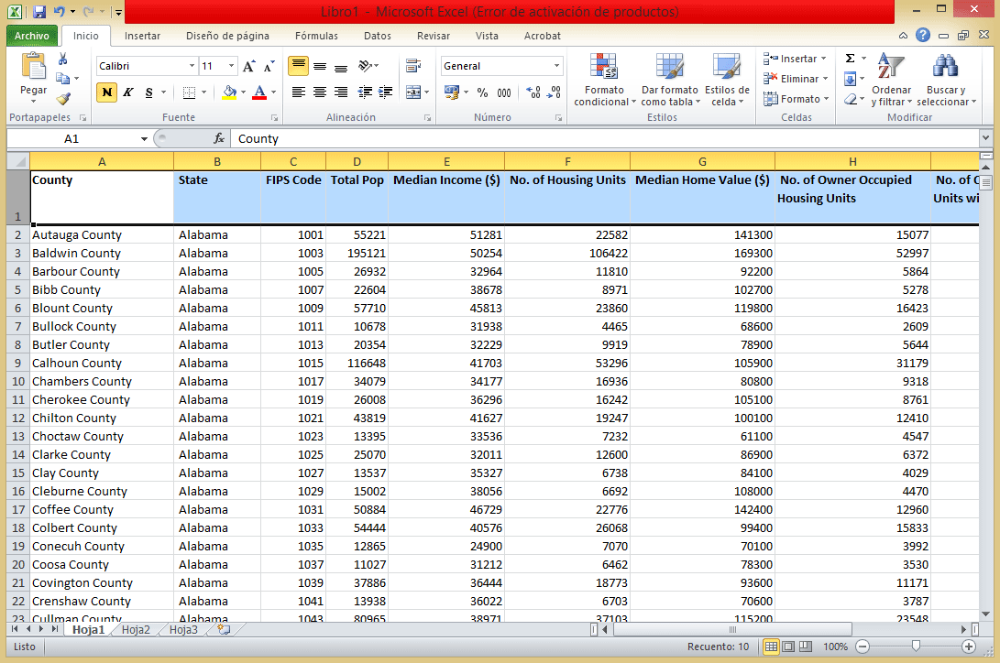

# Web Scraping using Beautiful Soup

## Summary

I am using Beautiful Soup for the this Python app. Beautiful Soup is a Python library for parsing data out of HTML and XML files (aka webpages). It works with your favorite parser to provide idiomatic ways of navigating, searching, and modifying the parse tree.

The major concept with Beautiful Soup is that it allows you to access elements of your page by following the CSS structures, such as grabbing all links, all headers, specific classes, or more. It is a powerful library. Once we grab elements, Python makes it easy to write the elements or relevant components of the elements into other files, such as a CSV, that can be stored in a database or opened in other software.

The data I used came from U.S. Basic Housing Stats by County. American Community Survey 5-year Estimates (2010-2015). Reference: http://duspviz.mit.edu/_assets/data/county_housing_stats.html



## Main goal

+ To access all of the content from the source code of the webpage with Python
+ Parse and extract data. 
+ Save the info in CSV file for further analysis.

## Methodology

1. Import Modules
2. Get the URL link
3. Navigate the URL Data Structure
4. Testing out data requests
5. Write data to a file in pseudo-code:
    + Open up a file to write in and append data.
    + Set up parameters for the while loop. 
    + Write headers
    + Run while loop that will write elements of the array to file
    + When complete, close the file
6. The output file in CSV format.

## Data info extracted:

County, State, FIPS Code, Total Pop, Median Income ($), No. of Housing Units, Median Home Value ($), No. of Owner Occupied Housing Units, No. of Owner Occ. Housing Units with Debt, No. of Owner Occ. Housing Units without Debt




If you don't have Beautiful Soup, install with 'conda install beautifulsoup' in terminal.

Python requires us to explicitly load the libraries that we want to use:


```python
# If you don't have Beautiful Soup, install with 'conda install beautifulsoup' in terminal
# Python requires us to explicitly load the libraries that we want to use:

import math
from math import pi
import matplotlib as plt
import requests
import bs4
```

Load a webpage into python so that we can parse it and manipulate it.


```python
# Load a webpage into python so that we can parse it and manipulate it.
# Control of Connection
# We just turned the website code into a Python object. 

URL = 'http://duspviz.mit.edu/_assets/data/county_housing_stats.html'
response = requests.get(URL)
```

Control of Connection. We just turned the website code into a Python object. 


```python
soup = bs4.BeautifulSoup(response.text, "html.parser")
```

Find all the tags with class County, State, FIPS Code, Total Pop, Median Income ($), No. of Housing Units, Median Home Value ($), No. of Owner Occupied Housing Units, No. of Owner Occ. Housing Units with Debt, No. of Owner Occ. Housing Units without Debt


```python
# find all the tags with class County, State, FIPS Code, Total Pop, Median Income ($), No. of Housing Units, Median Home Value ($), No. of Owner Occupied Housing Units, No. of Owner Occ. 
# Housing Units with Debt, No. of Owner Occ. Housing Units without Debt
data = soup.findAll(attrs={'class':['name','fips','tot-pop','median-income','no-housing-units','med-home-val','owner-occupied','house-w-debt','house-wo-debt']})
```




```python
f = open('hilca_us_stats_data.csv','a') # open new file, make sure path to your data file is correct

p = 0 # initial place in array
l = len(data)-1 # length of array minus one
```

Open new file, make sure path to your data file is correct.

Later, I write headers


```python
f.write("County, State, FIPS Code, Total Pop, Median Income ($), No. of Housing Units, Median Home Value ($), No. of Owner Occupied Housing Units, No. of Owner Occ. Housing Units with Debt, No. of Owner Occ. Housing Units without Debt\n") #write headers
```


```python
while p < l: # while place is less than length
    f.write(data[p].string + ", ") # write county and add comma
    p = p + 1 # increment
    f.write(data[p].string + ", ") # write FIPS and add comma
    p = p + 1 # increment
    f.write(data[p].string + ", ") # write Total Pop and add comma
    p = p + 1 # increment
    f.write(data[p].string + ", ") # write Median Income and add comma
    p = p + 1 # increment
    f.write(data[p].string + ", ") # write No. of Housing Units and add comma
    p = p + 1 # increment
    f.write(data[p].string + ", ") # write Median Home Value and add comma
    p = p + 1 # increment
    f.write(data[p].string + ", ") # write No. of Owner Occupied Housing Units and add comma
    p = p + 1 # increment
    f.write(data[p].string + ", ") # write No. of Owner Occ. Housing Units with Debt and add comma
    p = p + 1 # increment
    f.write(data[p].string + "\n") # write No. of Owner Occ. Housing Units without Debt and line break
    p = p + 1 # increment
```


```python
f.close() # close file
```



## Conclusiones

We used Beautiful Soup as the main tool. The major concept with Beautiful Soup is that it allows you to access elements of your page by following the CSS structures, such as grabbing all links, all headers, specific classes, or more. It is a powerful library.

 Once we grab elements, Python makes it easy to write the elements or relevant components of the elements into other files, such as a CSV, that can be stored in a database or opened in other software.
